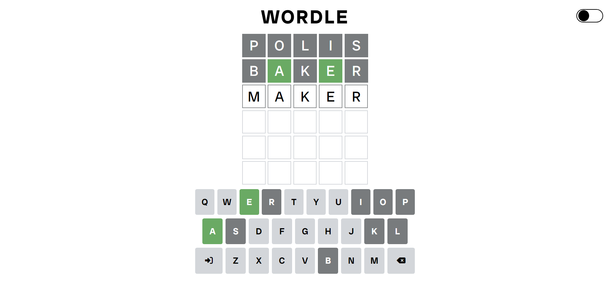

# Wordle Clone

## Table of Contents
- [Description](#description)
- [Project Goals](#project-goals)
- [Screenshots](#screenshots)
- [Links](#links)
- [What I Learned](#what-i-learned)
- [Future Improvements](#future-improvements)
- [Author](#author)

## Description
This project is a clone of the popular game 'Wordle,' featuring most of the gameplay mechanics and a close replica of the UI.

## Project Goals
This project is a practice exercise. By replicating Wordle, I aimed to improve my HTML, CSS, and JavaScript skills while enhancing my problem-solving abilities.

## Screenshots

## Links
- [Live Demo](https://iliasghar.github.io/wordle-clone/)
- [GitHub Repository](https://github.com/iliAsghar/wordle-clone)

## What I Learned
While making this project, I worked with methods I wasn't comfortable with, which helped me understand them better. By examining the UI layout of the original page, I also picked up some tips and tricks they used to improve the website/UI.

## Future Improvements
There are many things I would like to add to the page if I had the chance to build it again. For example, I would like to create a version that works with another language or use APIs to get today's word, syncing all the data with localStorage, and so on.

## Author
- iliAsghar